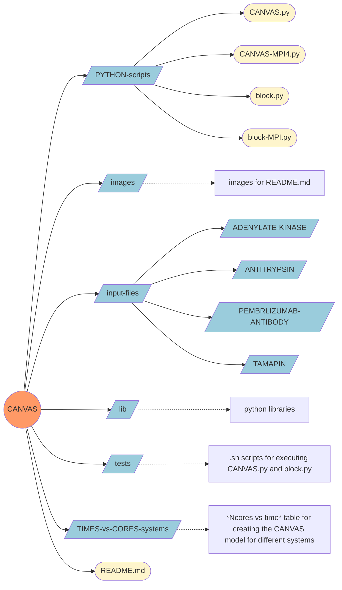
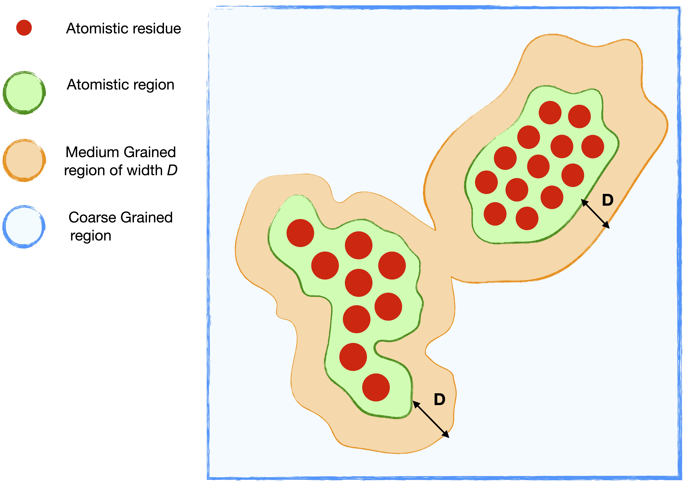
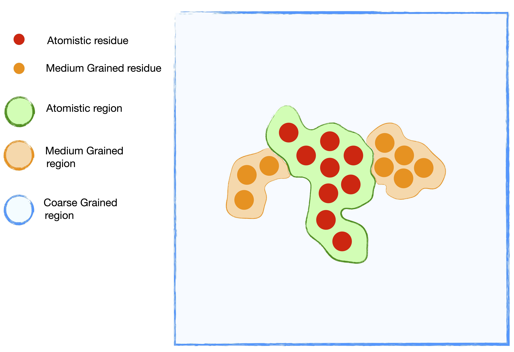

<div align="center">


</div>

# 0 - Introduction 

<p align="justify"> The <b>CANVAS</b> model is a novel Multiple-Resolution approach which allows one to model at an atomistic resolution only the precise subset of degrees really necesssary for the study of a given phenomenon, even when this leads to a boundary between resolutions which falls within a bio-molecule. </p>

<p align="justify"> CANVAS is the acronym of <b>C</b>oarse-grained <b>A</b>nisotropic <b>N</b>etwork model for <b>VA</b>riable resolution <b>S</b>imulation. </p>

<p align="justify"> The CANVAS strategy leverages the blurred and approximate nature of coarse-grained models to identify effective sites based on a user-provided input, and determines the interactions among them based on the molecule’s structure and all-atom force field, making it unnecessary to run reference simulations. This strategy makes the parametrisation of the model practically instantaneous, and allows the modulation of the system’s resolution in a quasi-continuous manner across the structure, from all-atom to (very) coarse-grained. Most notably, the interaction between regions of the system at different resolution (including the solvent) is accounted for and straightforward to set up, allowing the seamless implementation in standard MD software packages (e.g. GROMACS or LAMMPS).  </p>

<p align="justify"> In the current implementation, we performed the choice of employing three levels of resolution: </p>

<div align ="justify">
<ul>
  <li> <b><code>all-atom (AT)</code></b>: the highest level of detail, where all the atoms of a given amino acid
are retained;</li> <br/>

  <li> <b><code>medium-grained (MG)</code></b>: intermediate level of detail, where only the backbone atoms of an amino acid are retained, i.e. the carbon alpha <b>CA<sub>mg</sub></b>, the nitrogen <b>N<sub>mg</sub></b> of the amino group, the oxygen <b>O<sub>mg</sub></b> and the carbon <b>C<sub>mg</sub></b> of the carboxyl group.</li> <br/>

  <li> <b><code>coarse-grained (CG)</code></b>: the lowest level of resolution. In the applications presented here, only the <b>C<sub>α</sub></b> atoms of each CG residue are kept, dubbed <b>CA<sub>cg</sub></b>. </li>

</ul>
</div>

<div align="center">

</div>

<br><br>

<p align="justify"> The method is presented and validated on two case studies, the enzyme <b>Adenylate Kinase</b> and the therapeutic antibody <b>Pembrolizumab</b> in acqueous solution, by comparing results obtained with the CANVAS model against fully atomistic simulations. </p>

<p align="justify"> All the details of the work can be found in the following paper: <b>Fast, accurate, and system-specific variable-resolution modelling of proteins</b>, <i>R. Fiorentini, T. Tarenzi, R. Potestio</i>, https://doi.org/10.1021/acs.jcim.2c01311 </p>

<br />

# 1 - Requirements  

<p align="justify"> The following requirements need to be fulfilled: </p>


<div align ="justify">
<ul>
  <li> <b><code>GROMACS</code></b>: GROMACS is a versatile package used for molecular dynamics simulations. You can find the installation guide at <a href="https://manual.gromacs.org/documentation/2018-current/install-guide/index.html">this link</a>. Please note that this code has been tested with GROMACS-2018, but it should work with other versions of the software as well. </li> </br>
  
  <li> <b><code>Python3</code></b>: Python3 is an interpreted, object-oriented, high-level programming language with dynamic semantics. You can refer to the installation guide provided <a href="https://docs.python-guide.org/starting/installation/">here</a>. If you are using a Linux or macOS system, Python3 should already be installed. However, if you are using Windows, it might not be pre-installed. Please ensure that you have Python3 installed (preferably version 3.7 or 3.9) as this code will produce an error if run with Python2. </li> </br>
  
  <li> <b><code>VMD</code></b>: VMD is a molecular visualization program used for displaying, animating, and analyzing large biomolecular systems using 3-D graphics and built-in scripting. The latest version of VMD can be found <a href="https://www.ks.uiuc.edu/Development/Download/download.cgi?PackageName=VMD">here</a>, and the installation guide is available at <a href="https://www.ks.uiuc.edu/Research/vmd/current/ig/node6.html">this link</a>. While not mandatory, <b>we strongly recommend installing VMD</b> as it is used for biomolecule visualization and certain analyses in our code. </li> </br>
  
  <li> <b><code>LAMMPS</code></b>: LAMMPS is another versatile package for performing molecular dynamics simulations. The installation guide can be found
    <a href="https://docs.lammps.org/Install.html">here</a>. You only need to install LAMMPS if you intend to simulate biomolecules using LAMMPS instead of GROMACS, as it is mandatory for such cases. </li> </br>
    
</ul>
</div>

# 2 - Tree Diagram 

<p align="justify"> To facilitate a comprehensive understanding of the code's usage, a tree diagram illustrating the sequence of files and directories is provided hereafter for easy reference before proceeding with further instructions. </p>



<br />

<p align="justify"> To enhance clarity and compactness, the directory folders in the tree diagram are depicted in light blue, while files are represented in light yellow. Grey boxes are utilized to indicate the contents within the folders, excluding specific files and directories for the purpose of maintaining a concise and easily understandable diagram. </p> 

# 3 - Usage 

<p align="justify"> The typical usage of the program consists of calling <i><code>block.py</code></i> and <i><code>CANVAS.py</code></i> in succession using Python3. An MPI version of the codes, <i><code>block-MPI.py</code></i> and <i><code>CANVAS-MPI4.py</code></i>, is also available, utilizing the <i>multiprocessing</i> module to exploit multiple processors simultaneously for creating the CANVAS model. The MPI version is recommended for systems with more than 10<sup>5</sup> atoms. For detailed information regarding performance and efficiency, please refer to <strong>Section 7</strong>. </p>

<p align="justify"> Afterward, it is possible to simulate the biomolecule using either Gromacs or Lammps, as described in <strong>Section 8</strong>. </p>

<div align ="justify">
<ul>
  <li> <b><code>block.py</code></b> or <b><code>block-MPI.py</code></b>: This script generates a file containing the list of survived atoms, which is a mandatory argument for <i><code>CANVAS.py</code></i> or <i><code>CANVAS-MPI4.py</code></i> as explained in <strong>Section 4.1</strong>. </li> </br>
  
  <li> <b><code>CANVAS.py</code></b> or <b><code>CANVAS-MPI4.py</code></b>: This script creates the necessary input files for simulating a solvated system with Multiple Resolution in Gromacs or Lammps and performs analysis on the system. </li>
</ul>
</div>

<p align="justify"> Before running the Python scripts, carefully read the following section, which provides detailed explanations of each task and argument. Additionally, ensure that the scripts are not moved outside the main folder (<code>canvas/</code>), as doing so will result in a fatal error that will be displayed on the screen. </p>

<br />

# 4 - block.py & block-MPI.py

## 4.0 - Scope 
<p align="justify"> The main scope of this preliminary code is to generate the list of atoms that will survive. Each atom is assigned a label: <b>AT</b> for atoms that will be modeled atomistically and <b>CG</b> for atoms that will be described in a medium- or coarse-grained manner. Essentially, the code takes into account the desired residues to be treated at a high resolution (atomistically) and the preferred subdivision type (atomistic, medium-grained, or coarse-grained). Three different options are available as shown in <b>Section 4.1</b>, and the aforementioned file is generated accordingly. </p>

## 4.1 - Tasks 

<p align="justify"> The code files <i><code>block.py</code></i> and its MPI version <i><code>block-MPI.py</code></i> can be found inside the <code>PYTHON-SCRIPT/</code> directory. These files are designed to generate a file containing a list of surviving atoms. Prior to running the code, the user is required to choose one of three available options based on the desired subdivision type: atomistic, medium-grained, or coarse-grained: </p>

<div align ="justify">
<ul>
  <li> <strong><code>choice1</code></strong>: In this option, the user selects one or more central atomistic residues that require an atomistic description. The code traces an atomistic sphere with a user-defined radius <em>R</em> around the central residue(s) (green circle in <b>Figure 1</b>). The region surrounding the sphere is a 3D-annulus of width <em>D</em>, where only the backbone atoms (<em>N</em>, <em>C<sub>α</sub></em>, <em>C</em>, <em>O</em>) are retained (orange area of <b>Figure 1</b>). The remainder of the system is modeled as coarse-grained (blue area of <b>Figure 1</b>). </li> </br>

  <div align="center">
  
  </div>
  <div align = "justify">
  <b>Figure 1</b> - <i> Pictorial representation of atomistic/medium-grained/coarse-grained division for <b>choice1</b>. The red points correspond at the central residues that require an atomistic description. The green, orange and the blue area correspond at the part of system with fully atomistic, medium-grained an coarse-grained description, respectively. </i> 
  </div>

<br /><br />

  <li> <strong>choice2:</strong> In this option, all residues requiring an atomistic description are known, and the high-resolution region is completely defined (green area in <strong>Figure 2</strong>). Around the high-resolution region, a medium-grained region of width <em>D</em> is traced, where only the backbone atoms (<em>N</em>, <em>C<sub>α</sub></em>, <em>C</em>, <em>O</em>) are retained (orange area in <strong>Figure 2</strong>). Unlike <i>choice1</i>, where the atomistic region is not fully defined initially, in <b>choice2</b> the atomistic region is defined a priori based on the knowledge of all residues. </li> </br></br>


  <div align="center">
  
  </div>
  <div align = "justify">
  <b>Figure 2</b> - <i> Pictorial representation of atomistic/medium-grained/coarse-grained division for <b>choice2</b>. The red points correspond at all the residues that require an atomistic description. The green, orange and the blue area correspond at the part of system with fully atomistic, medium-grained an coarse-grained description, respectively. </i>
  </div>

</br></br>

   <li> <strong>Choice 3:</strong> In this option, all residues requiring both atomistic and medium-grained descriptions (retaining only the backbone atoms) are known (green and orange areas in <strong>Figure 3</strong>, respectively). The coarse-grained region, where only <em>C<sub>α</sub></em> atoms are kept, is automatically determined. </li> </br>

  <div align="center">
  
  </div>
  <div align = "justify">
  <b>Figure 3</b> - <i> Pictorial representation of atomistic/medium-grained/coarse-grained division for <b>choice3</b>. The red and orange points correspond at all the residues that require an atomistic and medium-grained description, respecively. The green, orange and the blue area correspond at the part of system with fully atomistic, medium-grained an coarse-grained description, respectively. </i>
  </div>

</ul>
</div>

<br /><br />

<p align="justify"> Based on the selected option, please refer to the appropriate section. If you choose the <code>choice1</code> option, please refer to <b>Section 4.1.1</b>. If you choose the <code>choice2</code> option, please refer to <b>Section 4.1.2</b>. And if you choose the <code>choice3</code> option, please refer to <b>Section 4.1.3</b>.
</p>

<p align="justify"> Each task requires different input files, which are provided to the program as command-line options. You can get a brief explanation of the tasks and arguments by running the command <code>python3 block.py -h</code> or <code>python3 block.py --help</code>. Additionally, you can print a short usage message by typing <code>python3 block.py</code> or <code>python3 block.py -u</code>. The same flags are also available for <code>block-MPI.py</code>. </p> 

<br />

### 4.1.1 - choice1   (NEW ##4.2 - choice1)  

### (NEW ###4.2.1 - Requirements)
<p align="justify"> <b><code>choice1</code></b> task requires two mandatory files, i.e. the coordinates of all-atom structure of the biomolecule (<i><code>protein.gro</code></i>) and the list of central residues that require an atomistic description (<i><code>list_AT_res.dat</code></i>). On the other hand, the diameter value of medium-grained region of CANVAS model (<i><code>diameter_MG_region</code></i>) is an optional argument, that can also be changed (the default value is 1.0 nm). Furthermore, the MPI-version (<i></i>block-MPI.py</i>) gives the user the possibility to define the number of cores for parallelizing this code (<i><code>number_of_cores</code></i>): the default value is maxiumum number of available cores present in your laptop/cluster. For more detailed information on these arguments, please refer to <b>Section 4.2 (NEW = ????)</b>. </p> 

### (NEW ###4.2.2 - Usage)
<p align="justify"> To run the <b>block.py</b> (or <b>block-MPI.py</b>) script with <b>choice1</b> task, the command-line is the following: </p>

```bash
### SERIAL VERSION 
python3 block.py choice1 -g <protein.gro> -l <list_AT_res.dat> [-D <diameter_MG_region>] 

or

python3 block.py choice1 --gro  <protein.gro> --list <list_AT_res.dat> [--diameter <diameter_MG_region>] 
```
``` bash
### MPI VERSION 
python3 block-MPI.py choice1 -g <protein.gro> -l <list_AT_res.dat> [-D <diameter_MG_region>] [-n <number_of_cores>] 

or

python3 block-MPI.py choice1 --gro  <protein.gro> --list <list_AT_res.dat> [--diameter <diameter_MG_region>] [--ncpu <number_of_cores>]
```

<p align="justify"> The output of the program is the list of survived atoms. To obtain further information and execute the "block.py" script with the "choice1" option, please type on terminal  `python3 block.py choice1`.<a href="#footnote-1">[1]</a> </p>

<p id="footnote-1">[1] Here is my first footnote.</p>

[^1]: For simplicity, this command is referred to `block.py`, but nothing changes for `block-MPI.py`


### (NEW ###4.2.3 - Arguments)


**`Choice1`** option requires two mandatory files, i.e. the coordinates of all-atom structure of the biomolecule (_`protein.gro`_) and the list of central residues that require an atomistic description (_`list_AT_res.dat`_). On the other hand, the diameter value of medium-grained region of CANVAS model (_`diameter_MG_region`_) is an optional argument, that can also be changed (the default value is 1.0 nm). Furthermore, the MPI-version (_block-MPI.py_) gives the user the possibility to define the number of cores for parallelizing this code (_`number_of_cores`_): the default value is maxiumum number of available cores present in your laptop/cluster. The above mentioned arguments are described in **Sec. 4.2**.

In order to launch the **choice1** task the command-line is the following: 

```bash
### SERIAL VERSION 
python3 block.py choice1 -g <protein.gro> -l <list_AT_res.dat> [-D <diameter_MG_region>] 

or

python3 block.py choice1 --gro  <protein.gro> --list <list_AT_res.dat> [--diameter <diameter_MG_region>] 
```
``` bash
### MPI VERSION 
python3 block-MPI.py choice1 -g <protein.gro> -l <list_AT_res.dat> [-D <diameter_MG_region>] [-n <number_of_cores>] 

or

python3 block-MPI.py choice1 --gro  <protein.gro> --list <list_AT_res.dat> [--diameter <diameter_MG_region>] [--ncpu <number_of_cores>]
```

The output of the program is the list of survived atoms. To obtain further information and execute the "block.py" script with the "choice1" option, please type on terminal  `python3 block.py choice1`.[^1]

[^1]: For simplicity, this command is referred to `block.py`, but nothing changes for `block-MPI.py`

<br />

### 4.1.2 - choice2 
---------

**`Choice2`** option requires two mandatory files, i.e. the coordinates of all-atom structure of the biomolecule (_`protein.gro`_) and the list of **all** residues that require an atomistic description (_`list_all_AT_res.dat`_).  On the other hand, the diameter value of medium-grained region of CANVAS model (_`diameter_MG_region`_) is an optional argument, that can also be changed (the default value is 1.0 nm). Furthermore, the MPI-version (_block-MPI.py_) gives the user the possibility to define the number of cores for parallelizing this code (_`number_of_cores`_): the default value is maxiumum number of available cores present in your laptop/cluster. The above mentioned arguments are described in **Sec. 4.2**.

In order to launch the **choice2** task the command-line is the following:

```bash
### SERIAL VERSION 
python3 block.py choice2 -g <protein.gro> -l <list_all_AT_res.dat> [-D <diameter_MG_region>] 

or 

python3 block.py choice2 --gro  <protein.gro> --list <list_all_AT_res.dat> [--diameter <diameter_MG_region>] 
```
``` bash
### MPI VERSION 
python3 block-MPI.py choice2 -g <protein.gro> -l <list_all_AT_res.dat> [-D <diameter_MG_region>] [-n <number_of_cores>] 

or

python3 block-MPI.py choice2 --gro  <protein.gro> --list <list_all_AT_res.dat> [--diameter <diameter_MG_region>] [--ncpu <number_of_cores>]
```

The output of the program is the list of survived atoms. For further information, please type on terminal `python3 choice2`.[^1]

<br />

### 4.1.3 - choice3 
---------

**`Choice3`** option requires two mandatory files, i.e. the coordinates of all-atom structure of the biomolecule (_`protein.gro`_) and the list of **all** residues that require an atomistic and medium-grained description (_`list_all_AT_MG_res.dat`_). Furthermore, the MPI-version (_block-MPI.py_) gives the user the possibility to define the number of cores for parallelizing this code (_`number_of_cores`_): the default value is maxiumum number of available cores present in your laptop/cluster. The above mentioned arguments are described in **Sec. 4.2**.

In order to lunch the **choice3** task the command-line is the following:

```bash
### SERIAL VERSION 
python3 block.py choice3 -g <protein.gro> -l <list_all_AT_MG_res.dat> 

or 

python3 block.py choice3 --gro  <protein.gro> --list <list_all_AT_MG_res.dat> 
```
``` bash
### MPI VERSION 
python3 block-MPI.py choice3 -g <protein.gro> -l <list_all_AT_MG_res.dat> [-n <number_of_cores>] 

or

python3 block-MPI.py choice3 --gro  <protein.gro> --list <list_all_AT_MG_res.dat> [--ncpu <number_of_cores>]
```

The output of the program is the list of survived atoms. For further information, please type on terminal `python3 choice3`.[^1]

<br />

## 4.2 - Arguments 

As shown in Section 4.1, the file containing the coordinates of all-atom structure of the biomolecule (_`protein.gro`_) is always mandatory. Likewise, according with the task selected, three different files are mandatory; in particular:

&ensp; $\circ$  If **choice1** option is selected, the list of central residues that require an atomistic description (_`list_AT_res.dat`_) is needed; 

&ensp; $\circ$ If **choice2** option is selected, the list of _all_ residues that require an atomistic description (_`list_all_AT_res.dat`_) is requested; 

&ensp; $\circ$ If **choice3** option is selected, the list of _all_ residues that require an atomistic and medium-grained description (_`list_all_AT_MG_res.dat`_) is expected. 

On the other hand, if the option taken is **choice1** or **choice2**, the user has to opportunity to change the default value 
of diameter or the medium-grained region (1.0 nm is the default one).[^2]

[^2]: In **choice3** the diameter of medium-grained region cannot be set, as the user knows in advance all residues that require an a medium-grained resolution. 

Eventually, in case the MPI version  of the code is chosen (_block-MPI.py_), whatever the option taken, the user has the possibility to define the number of cores for parallelizing this code. 


A short explaination of files, the diameter value, and the number of cores is the following:

* **`protein.gro`**: File containing the coordinates of all-atom structure of the biomolecule in .gro format. 

* **`list_AT_res.dat (for choice1)`**: File having the list of central atomistic(s) residue(s) (first column) and corresponding atomistic(s) radius(ii) (second column). In particular, given the coordinates file of all-atom structure of the system, protein.gro, the _residue number_ corresponds at the first column of such file,[^3] while the radius _R_ (in nm) defines the atomistic sphere around the central residue(s)

[^3]: Look [here](https://manual.gromacs.org/archive/5.0.3/online/gro.html) for further information about **.gro** file 

```                                                           
|-----------------|----------------------------|                                        
| residue1 (int)  |   radius1 [nm] (int/float) |  
| residue2        |   radius2                  | 
| ........        |   ........                 |
| residueN        |   radiusN                  |  
|-----------------|----------------------------|                                     
```
                                   
* **`list_all_AT_res.dat (for choice2)`**: File containing the list of _all_ residues that require an atomistic description. In particular, given the coordinates file of all-atom structure of the biomolecule, protein.gro, the _residue number_ corresponds at the first column of such file.[^3]

```
|----------------|  
| residue1 (int) |  
| residue2       |  
| ........       |  
| residueM       |  
|----------------| 
```                                        
                                        
* **`list_all_AT_res.dat (for choice3)`**: File containing the list of _all_ residues that require an atomistic (first column) and medium-grained (second column) description. In particular, given the coordinates file of all-atom structure of the biomolecule, protein.gro, the _residue number_ is the first column of such file.[^3]

```
|-------------------|---------------------|  
| residue1_AT (int) |  residue1_MG (int)  |  
| residue2_AT       |  residue2_MG        |  
| residue3_AT       |  ........           |  
| residue4_AT       |  residueM_MG        |  
| ........          |                     |  
| residueN_AT       |                     |  
|-------------------|---------------------|  
```

* **`Diameter_MG_region`**: Diameter value (in nm) of the medium-grained region. Default value: 1.0 nm

* **`Number of Cores (MPI-version ONLY)`**: Integer number corresponding at the number of cores for parallelizing _block-MPI.py_ script. It goes between 1 and the maximum number of available cores present in the laptop/cluster, otherwise an error is returned. Default value: maxiumum number of available cores present in the laptop/cluster. 
                                        
In **Appendix**  we focus on each argument discussed breafly before.

<br />

# 5 - _CANVAS.py_ & _CANVAS-MPI4.py_

_CANVAS.py_ does not have _tasks_ in the sense explained in **Sec. 4.1**. Indeed, this script requires three mandatory files: the coordinates file of all-atom structure of the biomolecule [_`protein.gro`_], the list of the atoms that survive [_`list_survived_atoms.dat`_] and the topology file of the all-atom configuration [_`topol.top`_]. On the other hand, four arguments are optional: 

* the list of atoms in the Fully-AT structure splitted in different domains [_`dom.txt`_]; 

* the choice regarding the production of the input-files for simulating the biomocule in multiple-resolution in LAMMPS, rather than GROMACS (default simulating package) [_`-c/--code lammps `_]

* the option of also introducing rescaled non-bonded 1-4 interactions also on the interface AT-CG (by default, rescaled non-bonded 1-4 interactions are introduced only in the AT region) [_`-r/--resc14 Y`_] 

* the decision of not solvating the system (by default the system will be solvated and neutralized with sodium and chlorine ions) [_`-s/--solvate N`_]

Furthermore, the MPI-version (_block-MPI.py_) gives the user the possibility to define the number of cores for parallelizing this code [_`number_of_cores`_]: by default the script will exploit the maximum number of available cores present on laptop/cluster.

The arguments are described in **Sec. 5.1**. In order to launch the **CANVAS.py/CANVAS-MPI4.py** scripts, the command-line is the following:

```bash 
### SERIAL VERSION 
python3 CANVAS.py [-h] -i <protein.gro> -l <list_survived_atoms.dat> -t <topol.top> [-d <dom.txt>] [-r Y] [-c lammps] [-s n]

   or: 
   
python3 CANVAS.py [--help] --in <protein.gro> --list <list_survived_atoms.dat> --top <topol.top> [--dom <dom.txt>] [--resc14 Y] [--code lammps] [--solvate n]
```
```bash 
### MPI VERSION 
python3 CANVAS.py [-h] -i <protein.gro> -l <list_survived_atoms.dat> -t <topol.top> [-d <dom.txt>] [-r Y] [-c lammps] [-s n] [-n <number_of_cores>]

   or: 
   
python3 CANVAS.py [--help] --in <protein.gro> --list <list_survived_atoms.dat> --top <topol.top> [--dom <dom.txt>] [--resc14 Y] [--code lammps] [--solvate n] [--ncpu <number_of_cores>]
```

> **NOTE: Please, take in account that _list_survived_atoms.dat_ is the output file obtained after launching _block.py_.** 

A short explaination of arguments is provided by launching the command `python3 CANVAS.py -h` or `python3 CANVAS.py --help`. Alternatively, for printing a short usage message, please type: `python3 CANVAS.py` or `python3 CANVAS.py -u`.[^1] 

The output of the program consists of three directories, detailed described in **Sec.8**, with the purpose of simulating with Gromacs or Lammps a Biomolecule with the CANVAS model, and analyze the resulting data: 
 
* **other-files/**
* **run_simulation/**
* **analysis/**

<br />

## 5.1 - Arguments 

As shown in **Sec. 5** the coordinates file  of all-atom structure of the biomolecule (_protein.gro_), the file containing the list of survived atoms (_list_survived_atoms.dat_), and the topology file (_topol.top_) are always, mandatory. Moreover, the file containing the list of atoms splitted in different domain (_dom.txt_) is strongly recommended, even though is optional. On the other hand, the usage of the flags `-r/--resc14 Y` (_rescaled14_), `-c/--code lammps` (_codestring_), and `-s/--solvate n` (_solvatestring_) are optional. Eventually, in case the MPI version  of the code is chosen (_CANVAS-MPI4.py_), the user has the possibility to choose the number of cores for parallelizing this code. A short explaination of the above mentioned files is the following:

* **`protein.gro`**: File containing the coordinates of all-atom structure of the biomolecule in .gro format. 

* **`list_survived_atoms.dat`**: File containing the list of survived atoms, in terms of _atom number_ (first column) and its label (second column). In particular, given the coordinates file of all-atom structure of the biomolecule, protein.gro, the _atom number_ is the fourth column of such file.[^3] On the other hand, the label of the corresponding survived atom, can assume only two strings: 
   * _`at`_ in case the latter conserves the highest/atomistic resolution (i.e. its own atomistic properties)  
   * _`cg`_ in case of medium-grained or coarse-grained resolution. 
   
&ensp; &ensp; &ensp; <ins>Please, take in account that such file is the output file of block.py (or block-MPI.py) if correctly executed.</ins>

```                                
|----------------------|------------------------| 
| atom number 1 (int)  | label 1 ('at' or 'cg') |
| atom number 2        | label 2                |
| atom number 3        | label 3                |
| atom number 4        | label 4                |
| ....                 | ....                   |
| atom number N        | label N                |
|--------------------- |------------------------|  
```

* **`topol.top`**: File containing the topology of all-atom representation; 

* **`dom.txt`**: Optional - **but strongly recommended** - In principle a biomolecule presents more domains. Thus, it could be a good pratice writing a file containing the list of atoms separated in domains. Indeed, this file is very useful for preventing bonds between CG beads that belongs to different domains, for guarantee system flexibility when the CANVAS model is constructed.[^4] This file is organized as follows: 
  - Each row contains the _atom number_ [^3] of the atoms that belong to the same domain separated by spaces.  
  - The number of columns is equal to the number of domains.

[^4]: If _dom.txt_ is present, only bonds between CG beads (`mg` or `cg`) that belongs to different are ignored; on the other hands, bonds where at least an atom `at` is involved (AT-AT or CG-AT), cannot be excluded otherwise each domain in CANVAS model remains completely unconnected with the rest of system 

                            
```
|---------------------------------------------------|
| AT_Num-1   AT_Num-2   AT_Num-3   .....  AT_Num-N  |  # atoms of 1st domain
| AT_Num-10  AT_Num-11  AT_Num-12  .....  AT_Num-M  |  # atoms of 2nd domain
| .....      .....      .....      .....  .....     |  # atoms of nth domain     # Number of Domains: n
|---------------------------------------------------| 
```

* **`rescaled14`**: In this model, by default, rescaled non-bonded 1-4 interactions are introduced only in the fully-atomistic region. However, if `-r/--resc14 Y` is set, the latter are also maintained on the interface AT-CG. Indeed, if in all-atom representation a rescaled non-bonded interaction is present between two atoms whose rapresentation in the CANVAS model is AT-CG, the latter is kept in the multi-resolution model. [^5] Other strings, other than `Y` are not allowed.  
Keep attention, as it might create artifacts in MD simulation. If using charmm forcefield this flag is ignored.
              
[^5]: In case of CG-CG pairs, no rescaled non-bonded 1-4 interaction is applied, even if `-r/--resc14 Y` is set since it might create artifacts because each bead has espilon and sigma values far away from the all-atom reference. 
                  

* **`codestring`**: By default this script produces the input files needed for simulating the CANVAS model in Gromacs.[^6] However, if `-c/--code lammps` is set, then this script produces the input files needed for simulating the CANVAS model in lammps. Other string other are not allowed. 

[^6]: Also `-c/--code gromacs` is feasible, and it produce the input files needed for simulating the CANVAS model in Gromacs


* **`solvatestring`**: By default the system will be solvated (and then neutralized with Sodium and Chlorine ions)[^7]. However, if `-s/--solvate n` is set the biomolecule will not be solvated. Fr instance, you can use this flag in case of implicit solvent simulations.

[^7]: Also '-s/--solvate y' is feasible, and it has the effect of solvating the system.


* **`Number of Cores (MPI-version ONLY)`**: Integer number corresponding at the number of cores for parallelizing _CANVAS-MPI4.py_ script. It goes between 1 and the maximum number of available cores present in the laptop/cluster, otherwise an error is returned. Default value: maxiumum number of available cores present in the laptop/cluster. 


In the **Appendix** we focus on each argument discussed breafly before.

<br />


# 6 - Examples 

Inside the `tests/` directory there is the complete list of example files for the _Pembrolizumab_, _Adelynate Kinase_, and 
_Antitrypsin_ biomolecules, allowing the user to try **block.py** (or **block-MPI.py**) and **CANVAS.py** (or **CANVAS-MPI4.py**). 

Hereafter, for the sake of clarity, only three examples are reported. 


```perl
### MPI version 48 cores (max number available cores --> ignore flag -n), Pembrolizumb 0A, Charmm forcefield, Lammps simulating program  

CHARMM_PATH=../input-files/PEMBROLIZUMAB-ANTIBODY/sim-0A-charmm36m/charmm36-jul2021.ff

PYTHONDIR=../PYTHON-scripts

inputDIR=../input-files/PEMBROLIZUMAB-ANTIBODY/sim-0A-charmm36m

python3 $PYTHONDIR/block-MPI.py choice2 -g $inputDIR/apo-0A.gro -l $inputDIR/list-ATres-2nd-choice.txt -n 24 

echo $CHARMM_PATH | python3 $PYTHONDIR/CANVAS-MPI4.py -g $inputDIR/apo-0A.gro -l list-atoms-opt-2.txt -t $inputDIR/topol.top -d $inputDIR/dom.txt -c lammps -n 24 
```

```perl 
### Serial version, Pembrolizumb 3A, Amber forcefield, Gromacs simulating program 

PYTHONDIR=../PYTHON-scripts

inputDIR=../input-files/PEMBROLIZUMAB-ANTIBODY/sim-3A-amber99

python3 $PYTHONDIR/block.py choice2 -g $inputDIR/apo-3A.gro -l $inputDIR/list-ATres-2nd-choice.txt

python3 $PYTHONDIR/CANVAS.py -g $inputDIR/apo-3A.gro -l list-atoms-opt-2.txt -t $inputDIR/topol.top -d $inputDIR/dom.txt
```

```perl 
### MPI version 24 cores, Adenylate Kinase, Amber forcefield, Lammps simulating program, system not solvated 

PYTHONDIR=../PYTHON-scripts

inputDIR=../input-files/ADENYLATE-KINASE/sim-w-amber99

python3 $PYTHONDIR/block-MPI.py choice2 -n 24 -g $inputDIR/frame_4ake_125ns.gro -l $inputDIR/list-ATres-2nd-choice.txt

python3 $PYTHONDIR/CANVAS-MPI4.py -n 24 -g $inputDIR/frame_4ake_125ns.gro -l list-atoms-opt-2.txt -t $inputDIR/topol.top -d $inputDIR/dom.txt -c lammps -s n 
```


The output files of each test can be also found in `canvas/output-files/` directory.  

<br />


# 7 - Serial or Parellel? 

Which version of the python scripts is better to use? Serial or MPI? In order to ask this question let us start to explain the difference between them. 

1.  block.py and CANVAS.py make use of one processor on a given machine (your laptop or cluster) 
2.  block-MPI.py and CANVAS-MPI4.py make use of `multiprocessing module` that allows the programmer to fully leverage multiple processors on a given machine.

The final result is **exactly** the same: the CANVAS model of a generic biomolecule is created. 

According with the previous definition appears clear that the MPI version creates the model faster. However, depending on the the number of atoms in the fully-atomistic reference, the time for creating the CANVAS model is different:  
* $N \sim 10^3$ (_Tamapin_ or _Adenylate Kinase_): serial and MPI version have comparable speeds, and just few seconds are needed for creating the CANVAS model. 
* $N \sim 10^4$ (_Pembrolizumab_): increasing the number of cores, a slight gain, in terms of speed up, can been noticed when using the MPI-version (from few minutes, to less than one minute) 
* $N \sim 10^5$ (_Viral capsid_): the MPI-version creates the CANVAS model much faster than the serial version; indeed, increasing the number of cores, the time gradually passes from several hours to few minutes. 

Fig.4 shows the time (in seconds) for creating the CANVAS model, as a function of number of cores (processors) used for different systems: in particular, 1 core means that the serial version has been employed. 

<div align="center">


</div>
<div align = "center">
<b>Fig.4</b> - <i> time (in seconds) for creating the CANVAVS model starting from the all-atom reference, varying the number of cores, for different systems. The bigger the system, the more the time difference bewteen the usage of 1 and 48 cores </i>. 
</div>


# 8 - Simulating CANVAS model with GROMACS, analyze data, and Visualizing Proteins   

After executing in sequence _block.py_ (_block_MPI.py_) and _CANVAS.py_ (_CANVAS-MPI4.py_), three subfolders are created:

1. **`other-files`**: it contains a lot of intermediate files created by CANVAS.py: they are not useful per running simulation. However, the _initial-frame.gro_ file is helpful as it can be employed as reference frame for trajectory alignment, for Root Mean Square Deviation (RMSD) and  Root Mean Square Fluctuations (RMSF) calculations, and so on.

2. **`run-simulation`**: it contains all the ingredients needed for simulating a BioMolecule in Multiple Resolution through the CANVAS model. 

3. **`analysis`**: it contains .tcl script and text files for analyzing and visualizing the biomolecule in VMD

<br />

## 8.1 - Launching the Simulation in Gromacs 

In  order to launch the simulation of a biomolecule trhough the CANVAS model, go inside the **`run-simulation/`** directory and follow the standard simulation protocol: minimization, equilibration in nvt (50 ps), equilibration in npt (50 ps), and finally the run production (500 ns). 

```perl
gmx_mpi grompp -f em.mdp -c solvated_ions.gro -p topol_new.top -o em.tpr
gmx_mpi mdrun -v -deffnm em
```
```perl
gmx_mpi grompp -f nvt.mdp -c em.gro -r em.gro -p topol_new.top -o nvt.tpr
gmx_mpi mdrun -v -deffnm nvt
```
```perl 
gmx_mpi grompp -f npt.mdp -c nvt.gro -r nvt.gro -t nvt.cpt -p topol_new.top -o npt.tpr
gmx_mpi mdrun -v -deffnm npt
```
```perl 
gmx_mpi grompp -f run.mdp -c npt.gro -t npt.cpt -p topol_new.top -o run.tpr
gmx_mpi mdrun -v -deffnm run
```

Please, take in account that when using **charmm36-jul2021.ff**, a fatal error when launching the minimization occurs and it is printed on terminal. The latter is due to the fact that sodium and chloride ions in our files are labelled with **NA** and **CL** respectively, as for any other forcefield. Indeed, this version requires that ions must be marked with **SOD** and **CLA**. 

Therefore, until this issue is solved in the next version of Charmm36m.ff, it is possible to fix the error, substituting manually **NA** and/or **CL** ions present in `solvated_ions.gro` and in `topol_new.itp` files, with **SOD** and **CLA** respectively. 

After this change, the standard simulating protocol can be followed without errors. 

<br />

## 8.2 - Analysing Data & Visualizing Trajectory 

VMD installation is not mandatory; however it is useful for visualing trajectory and for making preliminary analysis, such as the Root Mean Square Fluctuation (RMSF) of only $C_\alpha$ carbon (atomistic, medium-grained and 
coarse-grained). This folder contains the following files: 

* **`CA_list.txt`**: list of the $C_\alpha$ atoms indexes separated by one white space, in one line. 

* **`radius_charge-allatom.txt`**: file splitted in four columns containing the index, the atom-name, 
  the radius (in Angstrom units) obtained by the value of $\sigma/2$, and the corresponding charge. This file 
  is then read by _radius_charge-allatom.tcl_, described hereafter. 
  
```        
|-------|----------------|-----------------|-----------------|  
| index |    at-type     | VdW_radius (AA) |    charge       |                            
|-------|----------------|-----------------|-----------------| 
|   1   | at-type1 (str) | radius1 (float) | charge1 (float) |
|   2   | at-type2       | radius2         | charge2         |    
|   3   | at-type3       | radius3         | charge3         |
|   4   | at-type4       | radius4         | charge4         |
|  .... |  ......        | .......         | ......          |
|   N   | at-typeN       | radiusN         | chargeN         |
|-------|----------------|-----------------|-----------------|  
```

* **`radius_charge-allatom.tcl`**: this script has the purpose of reading the _radius_charge-allatom.txt_ file. 
  In order to execute it by means of VMD, please launch the command _`source radius_charge-allatom.tcl`_ in
  TkConsole. Then, in order to visualize the radius size of each CG bead with a different coloration given by 
  the charge value, go on `Graphics/Representation/Create Rep` and create the following representation:

  ```java
  Select Atoms = resname MUL, Drawing Method = VDW, Coloring Method = beta
  ```
  In this way, each bead will have a different radius according the value of $\sigma/2$, and a color given by the 
  Beta Coloring Method: in particular, blue shades are indicative of positive charges, red shades are indicative of
  negative charges, while the white color corresponds to a neutral charge. The figure below displays the $4_A$ form 
  of Pembrolizumab in terms of this new representation just mentioned.  

<div align="center">
 
</div>
<div align = "center">
<b>Fig.5</b> - <i> CANVAS representation of $4_A$ form of Pembrolizumab in terms of atoms and beads </i> 
</div>


<br />

* **rmsf.tcl**: this script can be executed on the VMD TkConsole by launching in sequence the following commands:

  ```bash
  source rmsf.tcl
  rmsf_all_ca 
  ```
  If everything went fine, `rmsf.dat` file is returned in output. The latter contains the fluctuation values of each 
  $C_\alpha$ atom (atomistic, medium-grained, and coarse-grained)

<br />

# 9 - Fixing Errors when using Charmm36m forcefield 

This section reports two errors that it is possible to encounter if using charmm36m forcefields, and how to solve them. The first one regards the creation of all-atom topology given the coordinate file(.pdb or .gro). The second problem concernes the addition of ions for neutralizing the charge.  Thus, it is clear that the latter are forcefield dependent, and they are not related to the CANVAS model.

<br />

## 9.1 - Creating topology file 

When the coordinate (.gro) and the topology file (.top) is created using the Charmm36m forcefield using the command provided in Appendix-A below, a fatal error like this can be encountered: 

``` 
Fatal error:
Residue 194 named GLY of a molecule in the input file was mapped
to an entry in the topology database, but the atom CB used in
that entry is not found in the input file. Perhaps your atom
and/or residue naming needs to be fixed.

For more information and tips for troubleshooting, please check the GROMACS
website at http://www.gromacs.org/Documentation/Errors
-------------------------------------------------------
```

As proposed in this [link](https://gromacs.bioexcel.eu/t/newest-charmm36-port-for-gromacs/868/8), the problem is that the COO- terminus entry in `aminoacids.c.tdb` uses atom _CB_ as the third control atom for adding _OT1_ and _OT2_. Until it is fixed in the next release of the forcefield, please edit the line `2 8 OT C CA CB` in **aminoacids.c.tdb** to `2 8 OT C CA N` that fix the issue. 

Note that the charmm36m.ff present in `input-files` directory is modified according what above explained.

<br />

## 9.2 - Simulating CANVAS Model 

As already seen in **Sec. 8.1**, another issue can be encountered when using the last version (july 2021) of Charmm36m is due to a different denomination of ions. In every force-field sodium and chloride ions are indicated with NA and CL, respectively. However, in charmm36m 
they are named SOD and CLA. A solution for fixing the issue is modifying manually the `topol_new.itp` and `solvated_ions.gro` files, substituing: 
  *  **`NA`** with **`SOD`**  
  *  **`CL`** with **`CLA`** 

<br />

# 10 - Contacts 

Raffaele Fiorentini: raffaele.fiorentini@unitn.it


<br /><br />


# Appendix 

Hereafter, we focus on the arguments discussed breafly before in **Sec. 4.2**  and **Sec. 5.1**. 

## A - Coordinate input FILE 

The coordinate file is mandatory for both _block.py_ and _CANVAS.py_ and related MPI versions. The same file is recommended when launching these two python scripts.  

It must be provided in _gro_ format. It contains a molecular structure, that is the coordinates of each atom in the reference structure. As an example a the coordinate gro file of a biomolecule named Adenylate 
Kinase with 3241 atoms is the following:[^8]


```latex
Adenylate Kinase 
 3341
    1MET      N    1   4.508   3.059   5.730
    1MET     H1    2   4.415   3.098   5.714
    1MET     H2    3   4.488   2.964   5.756
    1MET     H3    4   4.556   3.093   5.813
    1MET     CA    5   4.587   3.078   5.609
    ....
    ....  
  214GLY    HA2 3338   4.388   2.523   4.183
  214GLY      C 3339   4.445   2.373   4.325
  214GLY    OC1 3340   4.324   2.345   4.340
  214GLY    OC2 3341   4.543   2.319   4.386
   9.97074   9.97074   9.97074
```

[^8]: For simplicity this file is cut. The integral version can be found in `input-files/ADENYLATE-KINASE/sim-w-amber99`
   
Detailed information can be found in [Gromacs-GroFile](https://manual.gromacs.org/archive/5.0.3/online/gro.html)

It is, also, possible to find coordinate files with pdb extension. Indeed, the crystallographic structure  of a biomolecule is, in general, in the latter format. The most of proteins/biomolecules can be dowloaded from [_Protein Data Bank_](https://www.rcsb.org) in pdb format.

However, it is possible to transform pdb format in the gro one by means of a [pdb2gmx](https://manual.gromacs.org/documentation/current/onlinehelp/gmx-pdb2gmx.html#gmx-pdb2gmx) GROMACS tool.

```bash
pdb2gmx -f <pdb FILE> -o <gro FILE> -water tip3p -ignh 
```

**Amber99sb-ildn** and **charmm36m** force-fields have been tested for performing a Multiple Resolution Simulation using CANVAS model; however, any other previous version of **Amber** and **Charmm** should not be a big deal. 

> **Note: in order that a forcefield is found, it is necessary that the main folder containing the latter is inside the gromacs installing package, or in current directory where the pdb file is present.** 

Please, take in account that the coordinate file of all-atom structure (_protein.gro_) is the reference structure from which the CANVAS model is constructed; therefore choose it carefully. Indeed, you can select the crystallographic version of the biomolecule, or other equilibrated frames.  

At the end, if everything went fine, the coordinate file (protein.gro) and the topology file (topol.top) will be created. The latter will be discussed in **Appendix B**.

<br />

## B - Topology FILE 

The topology file is mandatory for _CANVAS.py_. It is not used when launching _block.py_. 

This file contains the parameters and the bonded interactions of the reference structure. The topology file usually specify _`[bonds]`_ (2 atoms connected), _`[angles]`_ (3 atoms connected), and _`[dihedrals]`_ 
(4 atoms connected linearly).

*Amber99sb-ildn* and *Charmm36m* forcefields has been successfully tested and employed. 

As example, we report in [Urea-top](https://manual.gromacs.org/documentation/current/reference-manual/file-formats.html#top) the topology file for **Urea** in water. The topology files of Adelynate Kinase and Pembrolizumab employed in our work can be found in **`input-files/`** folder.

Further and detailed information can be found in [Gromacs-Topology](https://manual.gromacs.org/documentation/current/reference-manual/topologies/topology-file-formats.html)

A top file can be generated by [pdb2gmx](https://manual.gromacs.org/documentation/current/onlinehelp/gmx-pdb2gmx.html#gmx-pdb2gmx) after choosing a pdb or gro file: 

```bash
pdb2gmx -f <pdb/gro FILE> -water tip3p
```

At the end, if everything went fine, the topology file (topol.top) will be created.

<br />


## C - list_AT_res.dat 

This file is mandatory when launching _block.py_ after selecting the option **choice1**. This file contains the list of central atomistic(s) residue(s) (first column) and corresponding atomistic(s) radius(ii) (second column). In particular, given the coordinates file of all-atom structure of the system, protein.gro, the _residue number_ corresponds at the first column of such file,[^3] while the radius _R_ (in nm) defines the atomistic sphere around the central residue(s). The residue number is an integer number, while the radius could be integer or float. No strings, or special characters are permitted. An error message is printed on screen if some condition is not fulfilled.

```                                                                       
|-----------------|-----------------------|                                        
| residue1 (int)  |   radius1 (int/float) |  
| residue2        |   radius2             | 
| ........        |   ........            |
| residueN        |   radiusN             |  
|-----------------|-----------------------|                                     
```    

## D - list_all_AT_res.dat 

This file is mandatory when launching _block.py_ after selecting the option **choice2**.This file contains the list of _all_ residues that require an atomistic description. In particular, given the coordinates file of all-atom structure of the biomolecule, protein.gro, the _residue number_ corresponds at the first column of such file.[^3] The residue number is an integer number, thus no float, no strings, or special characters are permitted. An error message is printed on screen if some condition is not fulfilled.
                                    
```
|----------------|  
| residue1 (int) |  
| residue2       |  
| ........       |  
| residueM       |  
|----------------| 
```                                        
                                        
## E - list_all_AT_MG.dat

This file is mandatory when launching _block.py_ after selecting the option **choice3**. This file contains the list of _all_ residues that require an atomistic (first column) and medium-grained (second column) description. In particular, given the coordinates file of all-atom structure of the biomolecule, protein.gro, the _residue number_ is the first column of such file.[^3] The residue number is an integer number, thus no float, no strings, or special characters are permitted. An error message is printed on screen if some condition is not fulfilled.

```
|-------------------|---------------------|  
| residue1_AT (int) |  residue1_MG (int)  |  
| residue2_AT       |  residue2_MG        |  
| residue3_AT       |  ........           |  
| residue4_AT       |  residueM_MG        |  
| ........          |                     |  
| residueN_AT       |                     |  
|-------------------|---------------------|  
```

<br />

## F - list_survived_atoms.dat 

_list_survived_atoms.dat_ is a mandatory argument when launching _CANVAS.py_. The user is not require to write this file, as the latter is the output of _block.py_. It contains the list of survived atoms, in terms of _atom number_ (first column) and its label (second column). In particular, given the coordinates file of all-atom structure of the biomolecule, protein.gro, the _atom number_ is the fourth column of such file.[^3] On the other hand, the label of the corresponding survived atom, can assume only two strings: 
   * _`at`_ in case the latter conserves the highest/atomistic resolution (i.e. its own atomistic properties)  
   * _`cg`_ in case of medium-grained or coarse-grained resolution. 

```                                
|----------------------|------------------------| 
| atom number 1 (int)  | label 1 ('at' or 'cg') |
| atom number 2        | label 2                |
| atom number 3        | label 3                |
| atom number 4        | label 4                |
| ....                 | ....                   |
| atom number N        | label N                |
|--------------------- |------------------------|  
```

Hereafter, we report an example: 
   
```latex
   ...   ..
   449   at
   450   at
   451   at
   452   cg
   454   cg
   461   cg
   475   cg
   ...   ..
```


For the sake of completeness, please note that it is possible to write by yourself a text file containing the list of the atoms, each one labelled with the caption (`at` or `cg`) if you know in advance all the atoms that survived.  However, we do not encurage this precedure to continue
especially in case of biomolecules with tens of thousand atoms, since the probability to make mistakes becomes higher and higher.

<br />

## G - dom.txt 

The list of atoms splitted in different domains (dom.txt) is an optional argument when executing _CANVAS.py_, but we strongly encurage to make use of it. In principle a biomolecule presents more domains. Thus, it could be a good pratice writing a file containing the list of atoms separated in domains. Indeed, this file is very useful for preventing bonds between CG beads that belongs to different domains, for guarantee system flexibility when the CANVAS model is constructed.[^4] This file is organized as follows: 
  - Each row contains the _atom number_ [^3] of the atoms that belong to the same domain separated by spaces.  
  - The number of columns is equal to the number of domains.

                            
```
|---------------------------------------------------|
| AT_Num-1   AT_Num-2   AT_Num-3   .....  AT_Num-N  |  # atoms of 1st domain
| AT_Num-10  AT_Num-11  AT_Num-12  .....  AT_Num-M  |  # atoms of 2nd domain
| .....      .....      .....      .....  .....     |  # atoms of nth domain     # Number of Domains: n
|---------------------------------------------------| 
```

For instance, let us suppose that a protein consists of 33 atoms, divided in 3 domains of 13 atoms each. In this case, _dom.txt_ looks like as follows: 
 
```latex 
1 2 3 4 5 6 7 8 9 10 11 12 13
14 15 16 17 18 19 20 21 22 23
24 25 26 27 28 29 30 31 32 33
```

There is no automatic procedure to obtain automatically this file. Thus, you must write your own txt file. The following script could be useful to construct the file _dom.txt_ for N domains: 

```bash 
#!/bin/bash

rm dom.txt
touch dom.txt

dom1=$(for i in {A1..An}; do echo -n $i ""; done)
echo $dom1 >> dom.txt

dom2=$(for i in {B1..Bn}; do echo -n $i ""; done)
echo $dom2 >> dom.txt

domX=$(for i in {M1..Mn}; do echo -n $i ""; done)
echo $domX >> dom.txt
```

where in place of $A_1, A_2, B_1, B_2, M_1, M_2$ you should write the atomistic numbers. Please, note that the script works good if each domain 
is constituted by consecutive at_numbers.

<br />

## H - Diameter_MG_region 

The value of the diameter of the medium-grained region is set to the default value _1.0 nm_. If you want to change it use the  flag `-D <value (nm)>` when launching _block.py_. Integer or decimal numbers are equally accepted. be sure that _`D`_  is higher or equals to 0. _`D = 0`_, means that no medium-grained region is constructed and the system assumes only two resolutions: **fullyAT** and **Coarse-grained** (keeping only C-alpha atoms).

As already explained in **Sec. 4.2**, the value of diameter for medium-grained region can be set only when selecting **choice1** and **choice2** options. Indeed, **choice3** does not require the setting of its value since is unnecessary. 

<br />

## I - Rescaled14 (-r/--resc14 Y) 

In this model, by default, rescaled non-bonded 1-4 interactions are introduced only in the fully-atomistic region. However, if `-r/--resc14 Y` is set, the latter are also maintained on the interface AT-CG. Indeed, if in all-atom representation a rescaled non-bonded interaction is present between two atoms whose rapresentation in the CANVAS model is AT-CG, the latter is kept in the multi-resolution model. [^5] Other strings, other than `Y` are not allowed.  
Keep attention, as it might create artifacts in MD simulation. If using charmm forcefield this flag is ignored.

<br />

## L - Codestring (-c/--code lammps)  

By default this script produces the input files needed for simulating the CANVAS model in Gromacs.[^6] However, if `-c/--code lammps` is set, then this script produces the input files needed for simulating the CANVAS model in lammps. Other string other are not allowed. 

<br />

## M - Solvatestring (-s/--solvate n)

By default the system will be solvated (and then neutralized with Sodium and Chlorine ions)[^7]. However, if `-s/--solvate n` is set the biomolecule will not be solvated. Fr instance, you can use this flag in case of implicit solvent simulations.

<br />


## N - Number of Cores (MPI-version ONLY) 

Integer number corresponding at the number of cores for parallelizing _CANVAS-MPI4.py_ script. It goes between 1 and the maximum number of available cores present in the laptop/cluster, otherwise an error is returned. Default value: maxiumum number of available cores present in the laptop/cluster. 


